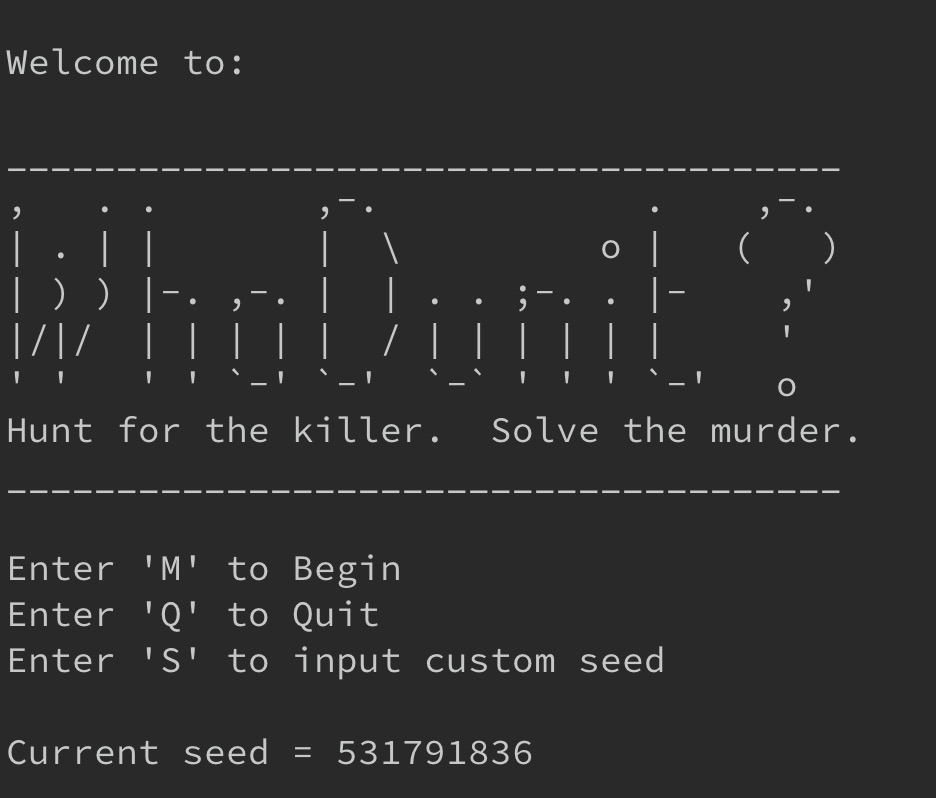

# WhoDunIt Text Game
## Murder mystery command line game using seeded procedural generation.

### To Compile With gcc Compiler and Run:
Via command-line, navigate to directory where cloned.

Change to 'whodunit-text-game' directory.

__To compile__, input:
	`g++ *.cpp -o whodunit.out`

This will compile and output an executable named 'whodunit.out'

__To run__, input:
	`./whodunit.out`

The game will begin and you should see the title screen shown above.

### Enjoy.